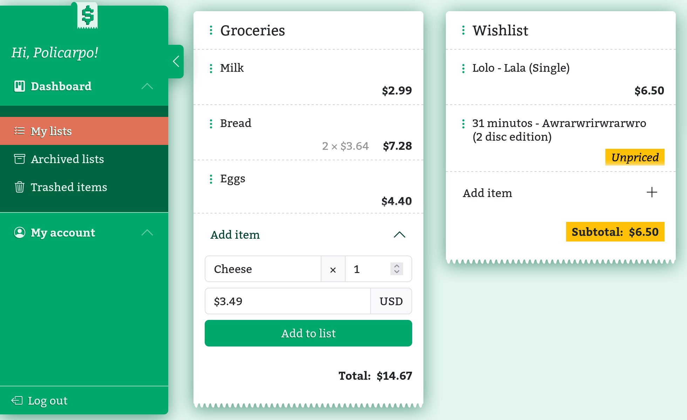

# &ensp;Boleta

A web app to create shopping lists.



<!-- Las funcionalidades que se planean desarrollar son:

- [x] Registro de usuario
- [ ] Recuperación de contraseña
- [x] Inicio/cierre de sesión
- [x] Actualizar datos de usuario
- [ ] Eliminar cuenta
- [x] Administrar listas
- [x] Administrar ítems de las listas
- [x] Sumar el precio de los ítems de una lista
- [ ] Restaurar ítems eliminados
- [ ] Archivar listas
- [ ] Gestión de usuarios para los administradores
- [ ] Registrar eventos
- [x] Detectar automáticamente el idioma del usuario (español o inglés)
- [ ] Cambiar tipo de moneda por lista -->

## How to use it

If there were any administrator user registered on the database, or the database were empty, the app will automatically creates a default administrator user with the following credentials:

- email: `mail@example.com`
- password: `Secret_4321`

You can run this app with it's corresponding PosgreSQL database using this `docker-compose.yml`&thinsp;:

```yaml
version: "3.8"
services:
  db:
    image: postgres:15.4-alpine3.18
    environment:
      # Setting up the user and the database for the app
      POSTGRES_USER: app-user
      POSTGRES_PASSWORD: secret
      POSTGRES_DB: app-db
    ports:
      - 5432:5432
    volumes:
      - ./db:/var/lib/postgresql/data:z
    healthcheck:
      test: ["CMD-SHELL", "pg_isready -d $${POSTGRES_DB} -U $${POSTGRES_USER}"]
      interval: 10s
      timeout: 5s
      retries: 5
  app:
    image: n1c0saurio/boleta:latest
    environment:
      # Default administrator user credentials can
      # be overwritten setting this variables
      ADMIN_EMAIL: email@example.com
      ADMIN_PASS:
        Secret_4321
        # Password must be 8 to 72 character long and
        # contain at least  a number, an upper and
        # a lowercase letter and a special character

      # Database credentials must be the same to
      # the declared on the db service
      DB: app-db
      DB_USER: app-user
      DB_PASS: secret
      DB_HOST: db
      DB_PORT: 5432

      # Set the secret for express-session
      SESSION_SECRET: keyboardcat
      # Where to expose the app
      PORT: 3000
    ports:
      - 3000:3000
```

This proyect was started to learn web developing using **Express.js**. Deleveloped in [Codium](https://github.com/VSCodium/vscodium/) under Fedora Linux.
